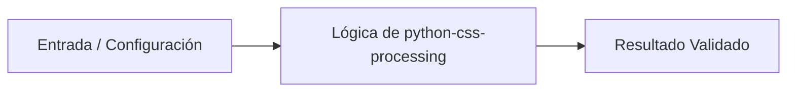

# 💡 Automatización y Procesamiento de CSS con Python

> **Origen:** [https://developer.mozilla.org/es/docs/Web/CSS](https://developer.mozilla.org/es/docs/Web/CSS)  
> **Complejidad:** `intermediate` | **Estándar:** `OKF v1.0.0`

---

## 📌 Resumen Conceptual y Propósito
CSS (Cascading Style Sheets) es el estándar fundamental para definir la presentación de documentos estructurados. En el desarrollo con Python, el procesamiento de CSS es vital para tareas de Web Scraping avanzado, generación de reportes dinámicos y la optimización de correos electrónicos HTML mediante el inlining de estilos para asegurar compatibilidad entre clientes de correo.



---

## 🛠️ Requisitos de Instalación
```bash
pip install tinycss2>=1.2.1 httpx>=0.27.0 premailer>=3.10.0
```

---

## 🚀 Casos de Uso y Scripts Minimalistas

### Caso 1: Análisis Sintáctico de Reglas CSS
* **Escenario:** Extracción de selectores y valores de una hoja de estilos para auditoría de diseño.
* **Código Minimalista:**

```python
import tinycss2

css_content = "body { color: #333; margin: 0; } .container { width: 100%; }"
rules = tinycss2.parse_stylesheet(css_content, skip_comments=True, skip_whitespace=True)

for rule in rules:
    if rule.type == 'qualified-rule':
        selector = ''.join([token.value for token in rule.prelude if hasattr(token, 'value')])
        print(f"Selector detectado: {selector.strip()}")
        declarations = tinycss2.parse_declaration_list(rule.content)
        for decl in declarations:
            if decl.type == 'declaration':
                print(f"  Propiedad: {decl.name} | Valor: {tinycss2.serialize(decl.value).strip()}")
```

---

### Caso 2: Extracción Asíncrona de Estilos Externos
* **Escenario:** Descarga y validación de archivos CSS externos desde una URL de forma concurrente.
* **Código Minimalista:**

```python
import asyncio
import httpx
import tinycss2

async def analyze_remote_css(url: str):
    async with httpx.AsyncClient() as client:
        response = await client.get(url)
        response.raise_for_status()
        rules = tinycss2.parse_stylesheet(response.text)
        rule_count = sum(1 for r in rules if r.type == 'qualified-rule')
        return {"url": url, "rules_found": rule_count}

async def main():
    urls = ["https://cdnjs.cloudflare.com/ajax/libs/normalize/8.0.1/normalize.css"]
    tasks = [analyze_remote_css(url) for url in urls]
    results = await asyncio.gather(*tasks)
    print(results)

if __name__ == "__main__":
    asyncio.run(main())
```

---

### Caso 3: Inlining de CSS para Emails de Producción
* **Escenario:** Transformación de un documento HTML con bloques de estilo en un HTML con estilos inline para máxima compatibilidad en clientes como Outlook o Gmail.
* **Código Minimalista:**

```python
from premailer import transform

html_template = """
<html>
    <head>
        <style>
            .button { background-color: #007bff; color: white; padding: 10px; }
            h1 { font-family: sans-serif; }
        </style>
    </head>
    <body>
        <h1>Notificación de Sistema</h1>
        <a href='#' class='button'>Confirmar Registro</a>
    </body>
</html>
"""

def generate_email_html(source_html: str) -> str:
    return transform(source_html, strip_important=False)

inlined_html = generate_email_html(html_template)
print(inlined_html)
```

---


## ⚠️ Consideraciones Técnicas y Gotchas
* **Buenas Prácticas:** Utilizar tinycss2 para parsing de bajo nivel por su cumplimiento estricto de las especificaciones W3C.
* **Buenas Prácticas:** Implementar inlining de CSS siempre que se generen correos electrónicos automatizados.
* **Buenas Prácticas:** Validar la existencia de selectores críticos antes de procesar transformaciones visuales.
* **Gotcha/Alerta:** Intentar parsear CSS complejo mediante expresiones regulares (Regex) en lugar de un parser formal.
* **Gotcha/Alerta:** Ignorar las reglas @media y @import al realizar análisis estáticos simples.
* **Gotcha/Alerta:** No manejar excepciones de red al descargar hojas de estilo externas en flujos asíncronos.

---

## 🔗 Nodos Relacionados en el Grafo
* [[01_Skills/SKILL_001_Scraping_y_Extraccion_Web|Habilidad Técnica: Scraping y Extracción Web]]
* [[03_Proyectos/PROJ_001_Agente_Scraper|Proyecto: Agente Scraper]]
