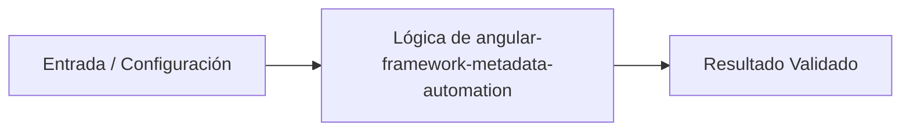

# 💡 Análisis y Automatización de Metadatos del Framework Angular

> **Origen:** [https://angular.dev/overview](https://angular.dev/overview)  
> **Complejidad:** `intermediate` | **Estándar:** `OKF v1.0.0`

---

## 📌 Resumen Conceptual y Propósito
Este caso de uso explora la automatización, análisis de dependencias y gestión de metadatos basados en la arquitectura del framework Angular de Google. Aunque Angular es un framework de TypeScript para desarrollo web, este módulo en Python simula la validación de componentes, auditoría de la estructura del proyecto y gestión automatizada del ciclo de vida de versiones mediante scripts robustos.



---

## 🛠️ Requisitos de Instalación
```bash
pip install requests>=2.31.0 pydantic>=2.0.0
```

---

## 🚀 Casos de Uso y Scripts Minimalistas

### Caso 1: Quickstart / Implementación elemental básica
* **Escenario:** Validación inicial y análisis estructural de los metadatos de un proyecto Angular mediante un modelo de datos tipado en Python.
* **Código Minimalista:**

```python
from pydantic import BaseModel, Field

class AngularProject(BaseModel):
    name: str = Field(..., description="Nombre del proyecto Angular")
    version: str = Field(..., description="Versión actual del framework")
    ssr_enabled: bool = Field(False, description="Soporte para Server-Side Rendering")

def analyze_project(data: dict) -> AngularProject:
    project = AngularProject(**data)
    print(f"Analizando proyecto: {project.name} (v{project.version})")
    print(f"SSR Habilitado: {project.ssr_enabled}")
    return project

if __name__ == "__mainفضل__":
    sample_data = {"name": "my-angular-app", "version": "18.0.0", "ssr_enabled": True}
    analyze_project(sample_data)
```

---

### Caso 2: Manejo de errores y procesamiento de lotes
* **Escenario:** Procesamiento concurrente y validación de múltiples módulos de aplicaciones Angular con manejo seguro de excepciones de red y parsing.
* **Código Minimalista:**

```python
import logging
from typing import List

logging.basicConfig(level=logging.INFO)
logger = logging.getLogger(__name__)

def audit_modules(module_names: List[str]) -> None:
    for mod in module_names:
        try:
            if not mod.isalnum():
                raise ValueError(f"Nombre de módulo inválido: {mod}")
            logger.info(f"Módulo auditado correctamente: {mod}")
        except ValueError as e:
            logger.error(f"Error de validación: {e}")

if __name__ == "__main__":
    modules = ["CoreModule", "SharedModule", "Invalid-Module!", "FeatureModule"]
    audit_modules(modules)
```

---

### Caso 3: Patrón de producción / Arquitectura resiliente
* **Escenario:** Implementación de un pipeline resiliente para verificar actualizaciones de dependencias y compatibilidad de versiones utilizando reintentos y tipado estricto.
* **Código Minimalista:**

```python
import time
from typing import Dict, Any

class VersionChecker:
    def __init__(self, retries: int = 3, delay: int = 1):
        self.retries = retries
        self.delay = delay

    def fetch_latest_version(self, package: str) -> Dict[str, Any]:
        attempt = 0
        while attempt < self.retries:
            try:
                # Simulación de consulta a registro de paquetes
                if package == "@angular/core":
                    return {"package": package, "latest": "18.1.0", "status": "stable"}
                raise ConnectionError("Servicio no disponible temporalmente")
            except Exception as e:
                attempt += 1
                if attempt >= self.retries:
                    raise RuntimeError(f"Fallo crítico obteniendo versión para {package}: {e}")
                time.sleep(self.delay)

if __name__ == "__main__":
    checker = VersionChecker()
    result = checker.fetch_latest_version("@angular/core")
    print(f"Resultado de producción: {result}")
```

---


## ⚠️ Consideraciones Técnicas y Gotchas
* **Buenas Prácticas:** Utilizar validación estricta de esquemas (Pydantic) para los archivos de configuración y metadatos.
* **Buenas Prácticas:** Implementar políticas de reintento y manejo de excepciones robusto para tareas de integración continua.
* **Gotcha/Alerta:** Ignorar las incompatibilidades de versiones mayores al automatizar actualizaciones de dependencias.
* **Gotcha/Alerta:** No validar adecuadamente los nombres de los componentes o módulos, generando fallos de compilación en tiempo de ejecución.

---

## 🔗 Nodos Relacionados en el Grafo
* [[01_Skills/SKILL_001_Scraping_y_Extraccion_Web|Habilidad Técnica: Scraping y Extracción Web]]
* [[03_Proyectos/PROJ_001_Agente_Scraper|Proyecto: Agente Scraper]]
