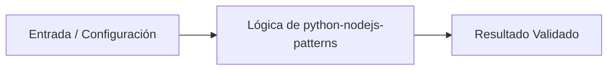

# 💡 Arquitectura de Servicios y Gestión de Recursos con Python (Inspirado en Node.js Core)

> **Origen:** [https://nodejs.org/docs/latest/api/](https://nodejs.org/docs/latest/api/)  
> **Complejidad:** `intermediate` | **Estándar:** `OKF v1.0.0`

---

## 📌 Resumen Conceptual y Propósito
Node.js es un entorno de ejecución orientado a eventos y E/S no bloqueante. Este análisis traduce sus módulos fundamentales (FS, HTTP, Crypto, Events) a implementaciones robustas en Python, utilizando asyncio para la concurrencia y librerías estándar para seguridad y persistencia, permitiendo construir sistemas escalables con patrones de diseño modernos.



---

## 🛠️ Requisitos de Instalación
```bash
pip install aiohttp>=3.9.0 cryptography>=42.0.0 pydantic>=2.0.0
```

---

## 🚀 Casos de Uso y Scripts Minimalistas

### Caso 1: Gestión de Sistema de Archivos y Rutas (FS & Path)
* **Escenario:** Implementación de persistencia local segura utilizando rutas relativas y manejo de directorios, equivalente al módulo 'fs' de Node.js.
* **Código Minimalista:**

```python
from pathlib import Path
import json
from typing import Dict, Any

def save_configuration(filename: str, data: Dict[str, Any]) -> Path:
    """Crea un directorio de datos y guarda un JSON de forma segura."""
    base_dir = Path("./storage")
    base_dir.mkdir(parents=True, exist_ok=True)
    
    file_path = base_dir / filename
    with file_path.open("w", encoding="utf-8") as f:
        json.dump(data, f, indent=4)
    
    return file_path.absolute()

if __name__ == "__main__":
    config = {"version": "26.8.1", "env": "production"}
    path = save_configuration("config.json", config)
    print(f"Configuración guardada en: {path}")
```

---

### Caso 2: Cliente HTTP Asíncrono con Reintentos (HTTP & Events)
* **Escenario:** Simulación del bucle de eventos de Node.js para realizar peticiones concurrentes con manejo de errores y lógica de reintento exponencial.
* **Código Minimalista:**

```python
import asyncio
import aiohttp
from typing import Optional, Dict

async def fetch_api_data(url: str, retries: int = 3) -> Optional[Dict]:
    """Realiza una petición GET asíncrona con manejo de excepciones y reintentos."""
    async with aiohttp.ClientSession() as session:
        for i in range(retries):
            try:
                async with session.get(url, timeout=10) as response:
                    response.raise_for_status()
                    return await response.json()
            except (aiohttp.ClientError, asyncio.TimeoutError) as e:
                if i == retries - 1:
                    print(f"Error final tras {retries} intentos: {e}")
                    return None
                wait_time = 2 ** i
                await asyncio.sleep(wait_time)
    return None

if __name__ == "__main__":
    url = "https://api.github.com/repos/nodejs/node"
    data = asyncio.run(fetch_api_data(url))
    if data: print(f"Repositorio: {data.get('full_name')}")
```

---

### Caso 3: Cifrado de Datos Sensibles (Crypto & Buffer)
* **Escenario:** Implementación de un vault de seguridad para cifrar secretos de configuración utilizando AES-256, equivalente al módulo 'crypto' de Node.js.
* **Código Minimalista:**

```python
import os
from cryptography.hazmat.primitives.ciphers import Cipher, algorithms, modes
from cryptography.hazmat.backends import default_backend
from cryptography.hazmat.primitives import padding

class DataVault:
    def __init__(self, key: bytes):
        self.key = key  # Debe ser de 32 bytes para AES-256

    def encrypt(self, plaintext: str) -> bytes:
        iv = os.urandom(16)
        cipher = Cipher(algorithms.AES(self.key), modes.CBC(iv), backend=default_backend())
        encryptor = cipher.encryptor()
        
        padder = padding.PKCS7(128).padder()
        padded_data = padder.update(plaintext.encode()) + padder.finalize()
        
        ciphertext = encryptor.update(padded_data) + encryptor.finalize()
        return iv + ciphertext

if __name__ == "__main__":
    master_key = os.urandom(32)
    vault = DataVault(master_key)
    secret_token = "node_v26_secure_token_xyz"
    encrypted_blob = vault.encrypt(secret_token)
    print(f"Payload cifrado (IV+Data): {encrypted_blob.hex()}")
```

---


## ⚠️ Consideraciones Técnicas y Gotchas
* **Buenas Prácticas:** Usar pathlib en lugar de os.path para una manipulación de rutas más legible y orientada a objetos.
* **Buenas Prácticas:** Implementar timeouts globales en todas las operaciones de red asíncronas para evitar fugas de recursos.
* **Buenas Prácticas:** Utilizar siempre algoritmos de cifrado estándar (como AES-GCM o CBC con padding) y nunca implementar criptografía propia.
* **Gotcha/Alerta:** No cerrar las sesiones de aiohttp, lo que provoca advertencias de recursos no liberados.
* **Gotcha/Alerta:** Ignorar el manejo de excepciones en operaciones de sistema de archivos (permisos denegados, disco lleno).
* **Gotcha/Alerta:** Hardcodear claves criptográficas en el código fuente en lugar de usar variables de entorno.

---

## 🔗 Nodos Relacionados en el Grafo
* [[01_Skills/SKILL_001_Scraping_y_Extraccion_Web|Habilidad Técnica: Scraping y Extracción Web]]
* [[03_Proyectos/PROJ_001_Agente_Scraper|Proyecto: Agente Scraper]]
