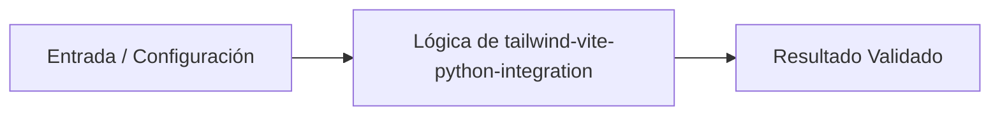

# 💡 Automatización e Integración de Tailwind CSS con Python

> **Origen:** [https://tailwindcss.com/docs/installation/using-vite](https://tailwindcss.com/docs/installation/using-vite)  
> **Complejidad:** `intermediate` | **Estándar:** `OKF v1.0.0`

---

## 📌 Resumen Conceptual y Propósito
Tailwind CSS es un framework de diseño basado en utilidades que optimiza la generación de estilos mediante el escaneo de archivos. Su integración con Vite permite un flujo de desarrollo ultra rápido con recarga en caliente. En entornos Python, esta herramienta se utiliza para orquestar el frontend moderno dentro de aplicaciones web robustas, permitiendo una separación clara entre la lógica de negocio y la interfaz de usuario altamente optimizada.



---

## 🛠️ Requisitos de Instalación
```bash
pip install fastapi>=0.100.0 uvicorn>=0.22.0 pydantic>=2.0.0
```

---

## 🚀 Casos de Uso y Scripts Minimalistas

### Caso 1: Scaffolding Automatizado de Proyecto Tailwind/Vite
* **Escenario:** Script para inicializar automáticamente la estructura de archivos y dependencias de Node.js necesarias para Tailwind CSS desde un entorno Python.
* **Código Minimalista:**

```python
import subprocess
import os
from pathlib import Path

def setup_tailwind_vite(project_name: str):
    path = Path(project_name)
    path.mkdir(exist_ok=True)
    
    commands = [
        f"npm create vite@latest {project_name} -- --template vanilla",
        f"cd {project_name} && npm install tailwindcss @tailwindcss/vite",
    ]
    
    for cmd in commands:
        subprocess.run(cmd, shell=True, check=True)

    vite_config = """import { defineConfig } from 'vite'
import tailwindcss from '@tailwindcss/vite'
export default defineConfig({
  plugins: [tailwindcss()],
})"""
    
    with open(path / "vite.config.ts", "w") as f:
        f.write(vite_config)

    with open(path / "src/style.css", "w") as f:
        f.write('@import "tailwindcss";')

if __name__ == "__main__":
    setup_tailwind_vite("my-tailwind-app")
```

---

### Caso 2: Orquestador Asíncrono de Servidor de Desarrollo
* **Escenario:** Ejecución concurrente del servidor de desarrollo de Vite junto con un backend de Python, manejando errores de proceso y señales de interrupción.
* **Código Minimalista:**

```python
import asyncio
import sys

async def run_process(command: str, prefix: str):
    process = await asyncio.create_subprocess_shell(
        command,
        stdout=asyncio.subprocess.PIPE,
        stderr=asyncio.subprocess.PIPE
    )

    async def log_stream(stream, p):
        while True:
            line = await stream.readline()
            if line:
                print(f"[{p}] {line.decode().strip()}")
            else:
                break

    await asyncio.gather(
        log_stream(process.stdout, prefix),
        log_stream(process.stderr, prefix)
    )

async def main():
    try:
        await asyncio.gather(
            run_process("npm run dev", "VITE"),
            run_process("python -m uvicorn main:app --reload", "PY-API")
        )
    except KeyboardInterrupt:
        print("\nStopping servers...")
        sys.exit(0)

if __name__ == "__main__":
    asyncio.run(main())
```

---

### Caso 3: Patrón de Producción: Inyección de Assets Compilados
* **Escenario:** Integración avanzada en FastAPI para servir archivos estáticos generados por Tailwind/Vite, detectando automáticamente el manifiesto de compilación.
* **Código Minimalista:**

```python
from fastapi import FastAPI
from fastapi.staticfiles import StaticFiles
from fastapi.responses import FileResponse
import json
from pathlib import Path

app = FastAPI()

class ViteAssetManager:
    def __init__(self, dist_path: str):
        self.dist_path = Path(dist_path)
        self.manifest = self._load_manifest()

    def _load_manifest(self):
        manifest_path = self.dist_path / ".vite/manifest.json"
        if manifest_path.exists():
            with open(manifest_path) as f:
                return json.load(f)
        return {}

    def get_main_css(self) -> str:
        # Lógica para extraer el path del CSS generado por Tailwind
        return self.manifest.get("index.html", {}).get("css", ["style.css"])[0]

asset_manager = ViteAssetManager("dist")

if Path("dist").exists():
    app.mount("/assets", StaticFiles(directory="dist/assets"), name="static")

@app.get("/")
async def serve_spa():
    return FileResponse("dist/index.html")

@app.get("/health")
async def health_check():
    return {"status": "online", "css_bundled": asset_manager.get_main_css()}
```

---


## ⚠️ Consideraciones Técnicas y Gotchas
* **Buenas Prácticas:** Utilizar el plugin oficial @tailwindcss/vite para una integración nativa sin configuraciones PostCSS manuales.
* **Buenas Prácticas:** Mantener el comando de escaneo de clases activo durante el desarrollo para evitar estilos faltantes.
* **Buenas Prácticas:** En producción, siempre servir los archivos desde la carpeta 'dist' generada tras el build de Vite.
* **Gotcha/Alerta:** No incluir el archivo CSS con el @import 'tailwindcss' en el punto de entrada principal.
* **Gotcha/Alerta:** Intentar ejecutar el servidor de desarrollo de Vite sin haber instalado las dependencias de Node.js previamente.
* **Gotcha/Alerta:** Conflictos de puertos entre el servidor de Vite (por defecto 5173) y el backend de Python.

---

## 🔗 Nodos Relacionados en el Grafo
* [[01_Skills/SKILL_001_Scraping_y_Extraccion_Web|Habilidad Técnica: Scraping y Extracción Web]]
* [[03_Proyectos/PROJ_001_Agente_Scraper|Proyecto: Agente Scraper]]
