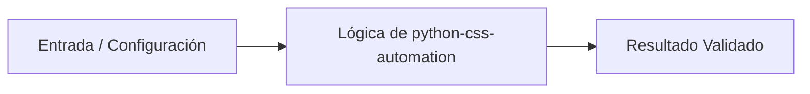

# 💡 Automatización y Procesamiento de CSS con Python

> **Origen:** [https://developer.mozilla.org/es/docs/Web/CSS](https://developer.mozilla.org/es/docs/Web/CSS)  
> **Complejidad:** `intermediate` | **Estándar:** `OKF v1.0.0`

---

## 📌 Resumen Conceptual y Propósito
CSS (Cascading Style Sheets) es el lenguaje estándar para definir la presentación de documentos estructurados. En entornos de desarrollo con Python, su manipulación es fundamental para la generación dinámica de interfaces, la validación de hojas de estilo en pipelines de CI/CD y la optimización de activos web mediante el análisis de selectores y propiedades.



---

## 🛠️ Requisitos de Instalación
```bash
pip install cssutils>=2.9.0 tinycss2>=1.2.1
```

---

## 🚀 Casos de Uso y Scripts Minimalistas

### Caso 1: Generación Dinámica de Estilos (Quickstart)
* **Escenario:** Generar una hoja de estilo básica basada en parámetros de configuración para un sistema de reportes HTML.
* **Código Minimalista:**

```python
def generate_dynamic_css(primary_color: str, font_size: int) -> str:
    """Genera un string CSS válido basado en variables de entrada."""
    template = f"""
    :root {{
        --main-color: {primary_color};
        --base-size: {font_size}px;
    }}
    body {{
        background-color: var(--main-color);
        font-size: var(--base-size);
        margin: 0;
    }}
    """
    return template.strip()

if __name__ == '__main__':
    css_output = generate_dynamic_css('#3498db', 16)
    print(css_output)
```

---

### Caso 2: Validación de Sintaxis y Manejo de Errores
* **Escenario:** Validar si un archivo CSS externo cumple con las especificaciones estándar antes de ser procesado por un motor de renderizado.
* **Código Minimalista:**

```python
import cssutils
import logging

def validate_css_content(css_text: str) -> bool:
    """Valida la sintaxis CSS y captura errores de parseo."""
    parser = cssutils.CSSParser(raiseExceptions=True)
    # Desactivar logs innecesarios de la librería
    cssutils.log.setLevel(logging.CRITICAL)
    
    try:
        sheet = parser.parseString(css_text)
        return sheet.valid
    except Exception as e:
        print(f"Error de sintaxis detectado: {e}")
        return False

bad_css = "body { color: red; font-size: 12px; invalid-prop: error; "
print(f"¿Es válido?: {validate_css_content(bad_css)}")
```

---

### Caso 3: Procesador de Temas y Minificación (Patrón Producción)
* **Escenario:** Implementar un motor de inyección de variables y minificación básica para un pipeline de despliegue de activos estáticos.
* **Código Minimalista:**

```python
import re
from typing import Dict

class CSSProcessor:
    """Procesador avanzado para manipulación de temas y optimización."""
    
    def __init__(self, raw_css: str):
        self.raw_css = raw_css

    def inject_theme(self, variables: Dict[str, str]) -> str:
        """Reemplaza placeholders de variables en el CSS."""
        processed = self.raw_css
        for key, value in variables.items():
            processed = processed.replace(f"{{{{{key}}}}}", value)
        return processed

    def minify(self, css: str) -> str:
        """Elimina espacios en blanco y saltos de línea innecesarios."""
        css = re.sub(r'\/\*.*?\*\/', '', css, flags=re.DOTALL)  # Comentarios
        css = re.sub(r'\s+', ' ', css)  # Espacios múltiples
        return css.replace('{ ', '{').replace(' }', '}').replace('; ', ';').strip()

# Uso en producción
raw_style = "body { color: {{text_color}}; } /* Comentario */ .container { margin: 10px; }"
processor = CSSProcessor(raw_style)
themed_css = processor.inject_theme({"text_color": "#333"})
final_css = processor.minify(themed_css)
print(f"CSS Final: {final_css}")
```

---


## ⚠️ Consideraciones Técnicas y Gotchas
* **Buenas Prácticas:** Utilizar librerías especializadas como cssutils para validación en lugar de expresiones regulares complejas.
* **Buenas Prácticas:** Implementar un sistema de logging para capturar propiedades CSS no soportadas o errores de parseo.
* **Buenas Prácticas:** Separar la lógica de generación de estilos de la lógica de negocio de la aplicación.
* **Buenas Prácticas:** Minificar el CSS resultante antes de servirlo en entornos de producción para reducir latencia.
* **Gotcha/Alerta:** Intentar parsear CSS complejo usando solo strings, lo que ignora reglas de especificidad y herencia.
* **Gotcha/Alerta:** No manejar excepciones al procesar archivos CSS externos que pueden contener sintaxis malformada.
* **Gotcha/Alerta:** Ignorar los prefijos de los navegadores (-webkit, -moz) al realizar validaciones estrictas.

---

## 🔗 Nodos Relacionados en el Grafo
* [[01_Skills/SKILL_001_Scraping_y_Extraccion_Web|Habilidad Técnica: Scraping y Extracción Web]]
* [[03_Proyectos/PROJ_001_Agente_Scraper|Proyecto: Agente Scraper]]
