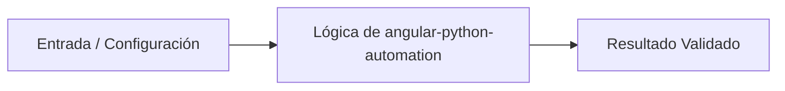

# 💡 Automatización y Orquestación de Ecosistemas Angular con Python

> **Origen:** [https://angular.dev/overview](https://angular.dev/overview)  
> **Complejidad:** `intermediate` | **Estándar:** `OKF v1.0.0`

---

## 📌 Resumen Conceptual y Propósito
Angular es un framework de desarrollo web mantenido por Google que se centra en la escalabilidad, reactividad mediante Signals y eficiencia mediante Server-Side Rendering (SSR). En entornos de ingeniería de software, Python actúa como el motor de automatización para gestionar el ciclo de vida de estas aplicaciones, facilitando el scaffolding, la validación de configuraciones complejas en monorepos y la orquestación de despliegues optimizados.



---

## 🛠️ Requisitos de Instalación
```bash
pip install pydantic>=2.6.0 aiofiles>=23.2.1
```

---

## 🚀 Casos de Uso y Scripts Minimalistas

### Caso 1: Generador de Scaffolding para Componentes Angular
* **Escenario:** Automatizar la creación de la estructura de archivos de un componente Angular (TS, HTML, CSS) siguiendo las mejores prácticas de encapsulación mencionadas en la documentación.
* **Código Minimalista:**

```python
import os
from pathlib import Path

def create_angular_component(name: str, base_path: str = './src/app') -> None:
    component_dir = Path(base_path) / name
    component_dir.mkdir(parents=True, exist_ok=True)
    
    files = {
        f'{name}.component.ts': f"import { { 'Component' } } from '@angular/core';\n\n@Component({\n  selector: 'app-{name}',\n  templateUrl: './{name}.component.html',\n  styleUrls: ['./{name}.component.css']\n})\nexport class {name.capitalize()}Component { }",
        f'{name}.component.html': f'<!-- {name} works! -->',
        f'{name}.component.css': '/* Styles */'
    }
    
    for filename, content in files.items():
        (component_dir / filename).write_text(content, encoding='utf-8')

if __name__ == '__main__':
    create_angular_component('user-profile')
```

---

### Caso 2: Validador Asíncrono de Integridad de Proyectos
* **Escenario:** Verificar de forma asíncrona la existencia de archivos críticos de configuración (angular.json, package.json) en múltiples proyectos de un monorepo para asegurar la compatibilidad con Angular CLI.
* **Código Minimalista:**

```python
import asyncio
import aiofiles
from pathlib import Path
from typing import List, Dict

async def check_project_health(project_path: str) -> Dict[str, bool]:
    critical_files = ['angular.json', 'package.json', 'tsconfig.json']
    results = {}
    for file in critical_files:
        file_path = Path(project_path) / file
        results[file] = file_path.exists()
    return results

async def audit_monorepo(paths: List[str]):
    tasks = [check_project_health(p) for p in paths]
    return await asyncio.gather(*tasks)

if __name__ == '__main__':
    projects = ['./apps/admin-panel', './apps/customer-portal']
    health_report = asyncio.run(audit_monorepo(projects))
    print(f'Audit Report: {health_report}')
```

---

### Caso 3: Validador de Configuración SSR para Producción
* **Escenario:** Implementar un patrón de validación robusto usando Pydantic para asegurar que la configuración de Server-Side Rendering (SSR) en angular.json cumple con los estándares de producción antes del despliegue.
* **Código Minimalista:**

```python
from pydantic import BaseModel, Field, ValidationError
from typing import Dict, Any
import json

class AngularProjectConfig(BaseModel):
    project_type: str = Field(..., pattern='^application$')
    ssr_enabled: bool = Field(alias='ssr', default=False)
    optimization: bool = True

def validate_ssr_config(config_data: Dict[str, Any]):
    try:
        # Simulación de lectura de sección 'architect' de angular.json
        project = AngularProjectConfig(**config_data)
        if project.ssr_enabled and project.optimization:
            return "Configuración SSR válida para producción."
        return "SSR no configurado o sin optimizaciones."
    except ValidationError as e:
        return f"Error de configuración: {e.json()}"

if __name__ == '__main__':
    raw_config = {"project_type": "application", "ssr": True, "optimization": True}
    print(validate_ssr_config(raw_config))
```

---


## ⚠️ Consideraciones Técnicas y Gotchas
* **Buenas Prácticas:** Utilizar Pathlib para la manipulación de rutas de archivos de forma agnóstica al sistema operativo.
* **Buenas Prácticas:** Implementar validaciones de esquema (Pydantic) para archivos de configuración JSON de Angular.
* **Buenas Prácticas:** Automatizar tareas repetitivas de Angular CLI mediante scripts de Python para pipelines de CI/CD.
* **Gotcha/Alerta:** No manejar excepciones de permisos de escritura al generar scaffolding de componentes.
* **Gotcha/Alerta:** Ignorar la codificación UTF-8 al leer o escribir archivos de TypeScript/HTML.
* **Gotcha/Alerta:** Hardcodear rutas que dependen de la estructura interna de node_modules.

---

## 🔗 Nodos Relacionados en el Grafo
* [[01_Skills/SKILL_001_Scraping_y_Extraccion_Web|Habilidad Técnica: Scraping y Extracción Web]]
* [[03_Proyectos/PROJ_001_Agente_Scraper|Proyecto: Agente Scraper]]
