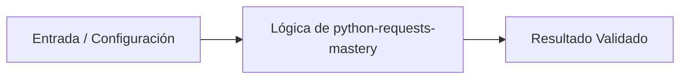

# 💡 Dominio de Peticiones HTTP con Requests

> **Origen:** [https://docs.python-requests.org/en/latest/user/quickstart/](https://docs.python-requests.org/en/latest/user/quickstart/)  
> **Complejidad:** `intermediate` | **Estándar:** `OKF v1.0.0`

---

## 📌 Resumen Conceptual y Propósito
Requests es la librería estándar de facto para realizar peticiones HTTP en Python, diseñada bajo el principio de 'HTTP para humanos'. Permite gestionar de forma abstracta y simplificada la complejidad de las cabeceras, parámetros de consulta, persistencia de sesiones y decodificación de contenido, facilitando la integración con APIs RESTful.



---

## 🛠️ Requisitos de Instalación
```bash
pip install requests>=2.31.0
```

---

## 🚀 Casos de Uso y Scripts Minimalistas

### Caso 1: Consumo Básico de API con Parámetros
* **Escenario:** Realizar una petición GET a un endpoint externo pasando parámetros de búsqueda de forma segura y tipada.
* **Código Minimalista:**

```python
import requests
from typing import Dict

def fetch_github_events(user: str) -> int:
    url: str = f'https://api.github.com/users/{user}/events'
    params: Dict[str, str] = {'per_page': '5'}
    response = requests.get(url, params=params)
    return response.status_code

if __name__ == '__main__':
    status = fetch_github_events('octocat')
    print(f'Status: {status}')
```

---

### Caso 2: Manejo de Errores y Timeouts
* **Escenario:** Implementar un flujo robusto que gestione tiempos de espera y valide estados HTTP para evitar bloqueos en la ejecución.
* **Código Minimalista:**

```python
import requests
from requests.exceptions import HTTPError, Timeout

def safe_request(url: str):
    try:
        # Timeout de 3.05 segundos (0.05 para conexión, 3 para lectura)
        response = requests.get(url, timeout=(0.05, 3))
        response.raise_for_status()
        return response.json()
    except Timeout:
        return {'error': 'The request timed out'}
    except HTTPError as http_err:
        return {'error': f'HTTP error occurred: {http_err}'}
    except Exception as err:
        return {'error': f'Other error occurred: {err}'}

data = safe_request('https://httpbin.org/delay/1')
print(data)
```

---

### Caso 3: Patrón de Sesión Resiliente con Reintentos
* **Escenario:** Configurar un cliente de producción que reutilice conexiones TCP y aplique una estrategia de reintento exponencial ante fallos temporales del servidor.
* **Código Minimalista:**

```python
import requests
from urllib3.util.retry import Retry
from requests.adapters import HTTPAdapter

def get_resilient_session() -> requests.Session:
    session = requests.Session()
    retry_strategy = Retry(
        total=3,
        backoff_factor=1,
        status_forcelist=[429, 500, 502, 503, 504],
        allowed_methods=["HEAD", "GET", "OPTIONS"]
    )
    adapter = HTTPAdapter(max_retries=retry_strategy)
    session.mount("https://", adapter)
    session.mount("http://", adapter)
    return session

client = get_resilient_session()
response = client.get('https://httpbin.org/status/500')
print(f'Final attempt status: {response.status_code}')
```

---


## ⚠️ Consideraciones Técnicas y Gotchas
* **Buenas Prácticas:** Utilizar siempre el parámetro 'timeout' para evitar que la aplicación se cuelgue indefinidamente.
* **Buenas Prácticas:** Emplear 'requests.Session()' para peticiones múltiples al mismo host para aprovechar el pooling de conexiones.
* **Buenas Prácticas:** Usar 'response.raise_for_status()' inmediatamente después de la petición para capturar errores 4xx y 5xx.
* **Gotcha/Alerta:** No definir timeouts, lo que puede agotar los workers de un servidor de aplicaciones.
* **Gotcha/Alerta:** Instanciar una nueva sesión o realizar peticiones directas en bucles de alta frecuencia, saturando el stack de red.
* **Gotcha/Alerta:** Confiar ciegamente en 'response.json()' sin verificar el 'Content-Type' de la respuesta.

---

## 🔗 Nodos Relacionados en el Grafo
* [[01_Skills/SKILL_001_Scraping_y_Extraccion_Web|Habilidad Técnica: Scraping y Extracción Web]]
* [[03_Proyectos/PROJ_001_Agente_Scraper|Proyecto: Agente Scraper]]
