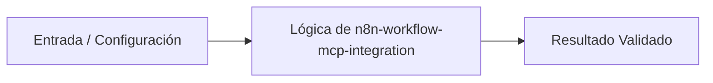

# 💡 Automatización de Flujos y Servidores MCP con n8n

> **Origen:** [https://docs.n8n.io/](https://docs.n8n.io/)  
> **Complejidad:** `intermediate` | **Estándar:** `OKF v1.0.0`

---

## 📌 Resumen Conceptual y Propósito
n8n es una herramienta de automatización de flujos de trabajo de código justo que combina características de IA con procesos de negocio. Permite conectar servidores de Protocolo de Contexto de Modelo (MCP) con clientes como Claude Desktop y Codex CLI para potenciar la automatización inteligente.



---

## 🛠️ Requisitos de Instalación
```bash
pip install requests>=2.31.0
```

---

## 🚀 Casos de Uso y Scripts Minimalistas

### Caso 1: Quickstart / Verificación de Conectividad con Servidor MCP n8n
* **Escenario:** Comprobar que el servidor MCP expuesto por n8n responde correctamente mediante una petición HTTP básica utilizando Python.
* **Código Minimalista:**

```python
import requests

def check_n8n_mcp(url: str) -> bool:
    try:
        response = requests.get(url, timeout=5)
        print(f"Estado del servidor n8n MCP: {response.status_code}")
        return response.status_code < 500
    except requests.RequestException as e:
        print(f"Error de conexión: {e}")
        return False

if __name__ == "__main__":
    server_url = "https://localhost/mcp-server/http"
    check_n8n_mcp(server_url)
```

---

### Caso 2: Manejo de Errores y Reintentos en la Comunicación HTTP con n8n
* **Escenario:** Implementar una estrategia de reintentos robusta ante fallos intermitentes de red al interactuar con las APIs o endpoints de n8n.
* **Código Minimalista:**

```python
import time
import requests
from requests.adapters import HTTPAdapter
from urllib3.util.retry import Retry

def get_resilient_session() -> requests.Session:
    session = requests.Session()
    retries = Retry(total=3, backoff_factor=1, status_forcelist=[500, 502, 503, 504])
    session.mount("https://", HTTPAdapter(max_retries=retries))
    return session

if __name__ == "__main__":
    session = get_resilient_session()
    try:
        response = session.get("https://localhost/mcp-server/http", timeout=10)
        print(f"Respuesta exitosa: {response.status_code}")
    except requests.exceptions.RetryError:
        print("Se agotaron los reintentos para conectar con el servidor n8n.")
```

---

### Caso 3: Patrón de Producción / Cliente Automatizado de Webhooks n8n
* **Escenario:** Construir un cliente orientado a producción capaz de enviar lotes de datos estructurados hacia un flujo automatizado de n8n con manejo de autenticación.
* **Código Minimalista:**

```python
import json
import requests

class N8nProductionClient:
    def __init__(self, webhook_url: str, api_key: str):
        self.webhook_url = webhook_url
        self.headers = {
            "Content-Type": "application/json",
            "X-N8N-API-KEY": api_key
        }

    def trigger_workflow(self, payload: dict) -> dict:
        response = requests.post(self.webhook_url, headers=self.headers, data=json.dumps(payload), timeout=15)
        response.raise_for_status()
        return response.json()

if __name__ == "__main__":
    client = N8nProductionClient(
        webhook_url="https://localhost/webhook/data-sync",
        api_key="dummy-api-key"
    )
    try:
        result = client.trigger_workflow({"event": "sync_start", "records": 150})
        print("Flujo disparado exitosamente:", result)
    except requests.RequestException as e:
        print(f"Fallo crítico en producción: {e}")
```

---


## ⚠️ Consideraciones Técnicas y Gotchas
* **Buenas Prácticas:** Utilizar tiempos de espera (timeouts) explícitos en todas las peticiones HTTP hacia n8n.
* **Buenas Prácticas:** Proteger las claves de API y endpoints mediante variables de entorno en lugar de hardcodearlas.
* **Gotcha/Alerta:** Ignorar los códigos de estado HTTP devuelven un error no controlado en los flujos.
* **Gotcha/Alerta:** No configurar políticas de reintento frente a caídas temporales del servidor n8n o contenedores Docker.

---

## 🔗 Nodos Relacionados en el Grafo
* [[01_Skills/SKILL_001_Scraping_y_Extraccion_Web|Habilidad Técnica: Scraping y Extracción Web]]
* [[03_Proyectos/PROJ_001_Agente_Scraper|Proyecto: Agente Scraper]]
