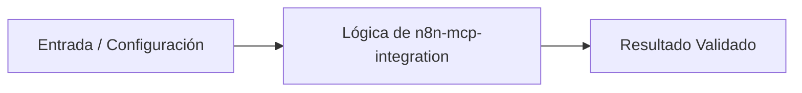

# 💡 Automatización de Workflows e Integración MCP con n8n

> **Origen:** [https://docs.n8n.io/](https://docs.n8n.io/)  
> **Complejidad:** `intermediate` | **Estándar:** `OKF v1.0.0`

---

## 📌 Resumen Conceptual y Propósito
n8n es una herramienta de automatización de flujos de trabajo de código abierto que combina capacidades de IA con procesos de negocio. Permite conectar servidores Model Context Protocol (MCP) con asistentes avanzados como Claude y OpenAI, facilitando la creación de endpoints API, agentes de IA conversacionales y procesamiento masivo de datos mediante una arquitectura extensible.



---

## 🛠️ Requisitos de Instalación
```bash
pip install requests>=2.31.0 pydantic>=2.0.0
```

---

## 🚀 Casos de Uso y Scripts Minimalistas

### Caso 1: Quickstart / Conexión Básica a Servidor n8n MCP
* **Escenario:** Establecer la comunicación inicial con un servidor MCP de n8n mediante peticiones HTTP para verificar el estado del nodo y listar las herramientas disponibles.
* **Código Minimalista:**

```python
import requests

def check_n8n_mcp_health(base_url: str) -> dict:
    endpoint = f"{base_url}/health"
    try:
        response = requests.get(endpoint, timeout=5)
        response.raise_for_status()
        return {"status": "success", "data": response.json()}
    except requests.exceptions.RequestException as e:
        return {"status": "error", "message": str(e)}

if __name__ == "__main__":
    server_url = "https://n8n-server.local/mcp-server/http"
    result = check_n8n_mcp_health(server_url)
    print(result)
```

---

### Caso 2: Manejo de Errores y Reintentos en Llamadas a Workflows
* **Escenario:** Implementar un mecanismo robusto con reintentos automáticos para invocar webhooks de n8n ante fallas temporales de red o latencia elevada.
* **Código Minimalista:**

```python
import time
import requests
from requests.adapters import HTTPAdapter
from urllib3.util.retry import Retry

def invoke_n8n_workflow_with_retry(webhook_url: str, payload: dict) -> dict:
    session = requests.Session()
    retries = Retry(total=3, backoff_factor=1, status_forcelist=[500, 502, 503, 504])
    session.mount("https://", HTTPAdapter(max_retries=retries))
    
    try:
        response = session.post(webhook_url, json=payload, timeout=10)
        response.raise_for_status()
        return response.json()
    except requests.exceptions.RequestException as e:
        return {"error": True, "details": str(e)}

if __name__ == "__main__":
    url = "https://n8n-server.local/webhook/process-data"
    res = invoke_n8n_workflow_with_retry(url, {"user_id": 42, "action": "sync"})
    print(res)
```

---

### Caso 3: Patrón de Producción / Cliente Asíncrono Resiliente para MCP
* **Escenario:** Creación de un cliente asíncrono y tipado utilizando Pydantic y httpx para interactuar de forma concurrente con múltiples endpoints de n8n y agentes de IA.
* **Código Minimalista:**

```python
import asyncio
import httpx
from pydantic import BaseModel, HttpUrl

class MCPRequest(BaseModel):
    server_url: HttpUrl
    tool_name: str
    arguments: dict

async def call_n8n_mcp_tool(client: httpx.AsyncClient, req: MCPRequest) -> dict:
    url = f"{req.server_url}/tools/{req.tool_name}"
    try:
        response = await client.post(str(url), json=req.arguments, timeout=15.0)
        response.raise_for_status()
        return {"tool": req.tool_name, "result": response.json()}
    except httpx.HTTPStatusError as e:
        return {"tool": req.tool_name, "error": f"HTTP error: {e.response.status_code}"}
    except httpx.RequestError as e:
        return {"tool": req.tool_name, "error": f"Connection error: {str(e)}"}

async def main():
    async with httpx.AsyncClient() as client:
        request_data = MCPRequest(
            server_url="https://n8n-server.local/mcp-server/http",
            tool_name="summarize_text",
            arguments={"text": "Automatización avanzada con n8n y Python."}
        )
        result = await call_n8n_mcp_tool(client, request_data)
        print(result)

if __name__ == "__main__":
    asyncio.run(main())
```

---


## ⚠️ Consideraciones Técnicas y Gotchas
* **Buenas Prácticas:** Validar siempre las cargas útiles (payloads) utilizando esquemas estrictos como Pydantic antes de enviarlas a los webhooks de n8n.
* **Buenas Prácticas:** Configurar tiempos de espera (timeouts) adecuados en todas las peticiones HTTP para evitar bloqueos en los hilos de ejecución.
* **Gotcha/Alerta:** No manejar adecuadamente los códigos de estado HTTP devueltos por los nodos de error en n8n.
* **Gotcha/Alerta:** Exponer URLs de webhooks o servidores MCP sin autenticación ni cabeceras de autorización firmadas.

---

## 🔗 Nodos Relacionados en el Grafo
* [[01_Skills/SKILL_001_Scraping_y_Extraccion_Web|Habilidad Técnica: Scraping y Extracción Web]]
* [[03_Proyectos/PROJ_001_Agente_Scraper|Proyecto: Agente Scraper]]
