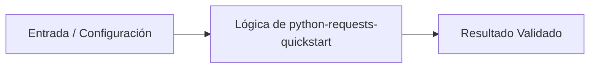

# 💡 Consumo de APIs y Peticiones HTTP con Python Requests

> **Origen:** [https://docs.python-requests.org/en/latest/user/quickstart/](https://docs.python-requests.org/en/latest/user/quickstart/)  
> **Complejidad:** `basic` | **Estándar:** `OKF v1.0.0`

---

## 📌 Resumen Conceptual y Propósito
La librería Requests es el estándar de facto en el ecosistema de Python para realizar peticiones HTTP de forma sencilla, intuitiva y robusta. Permite interactuar con servicios web mediante métodos HTTP estándar, manejar parámetros de consulta, gestionar cabeceras personalizadas y procesar respuestas en formatos como JSON o contenido binario.



---

## 🛠️ Requisitos de Instalación
```bash
pip install requests>=2.31.0
```

---

## 🚀 Casos de Uso y Scripts Minimalistas

### Caso 1: Quickstart / Implementación elemental básica
* **Escenario:** Realizar una petición GET simple a una API pública y procesar la respuesta en formato JSON.
* **Código Minimalista:**

```python
import requests

def fetch_github_events() -> None:
    url = "https://api.github.com/events"
    response = requests.get(url)
    
    print(f"Status Code: {response.status_code}")
    print(f"Encoding: {response.encoding}")
    
    data = response.json()
    print(f"Total events retrieved: {len(data)}")

if __name__ == "__main__":
    fetch_github_events()
```

---

### Caso 2: Manejo de Errores y Envío de Parámetros en URL
* **Escenario:** Construir una consulta HTTP con parámetros dinámicos utilizando diccionarios y validar códigos de error mediante excepciones.
* **Código Minimalista:**

```python
import requests

def search_httpbin() -> None:
    url = "https://httpbin.org/get"
    payload = {"key1": "value1", "key2": ["value2", "value3"]}
    
    try:
        response = requests.get(url, params=payload, timeout=5)
        response.raise_for_status()
        
        print(f"Generated URL: {response.url}")
        json_data = response.json()
        print(f"Args received: {json_data.get('args')}")
        
    except requests.exceptions.HTTPError as err:
        print(f"HTTP error occurred: {err}")
    except requests.exceptions.Timeout:
        print("The request timed out")
    except requests.exceptions.RequestException as err:
        print(f"An error occurred: {err}")

if __name__ == "__main__":
    search_httpbin()
```

---

### Caso 3: Patrón de Producción: Envío de JSON y Streaming de Archivos
* **Escenario:** Enviar datos estructurados en formato JSON con cabeceras personalizadas y descargar archivos grandes mediante streaming de bloques.
* **Código Minimalista:**

```python
import requests

def production_pattern_example() -> None:
    endpoint = "https://httpbin.org/post"
    headers = {"user-agent": "my-production-app/1.0.0"}
    payload = {"status": "active", "items": [1, 2, 3]}
    
    # Envío de POST con JSON automático
    response = requests.post(endpoint, json=payload, headers=headers)
    print(f"POST Status: {response.status_code}")
    
    # Descarga simulada por streaming
    stream_url = "https://httpbin.org/bytes/1024"
    with requests.get(stream_url, stream=True) as r:
        r.raise_for_status()
        total_bytes = 0
        for chunk in r.iter_content(chunk_size=128):
            total_bytes += len(chunk)
        print(f"Downloaded total bytes via stream: {total_bytes}")

if __name__ == "__main__":
    production_pattern_example()
```

---


## ⚠️ Consideraciones Técnicas y Gotchas
* **Buenas Prácticas:** Utilizar siempre response.raise_for_status() después de una petición para detectar códigos de error HTTP de forma temprana.
* **Buenas Prácticas:** Emplear el parámetro 'json' en lugar de serializar manualmente con json.dumps() para asegurar que la cabecera Content-Type se configure correctamente.
* **Gotcha/Alerta:** Confiar en r.json() sin validar primero el estado de la respuesta o manejar la excepción JSONDecodeError.
* **Gotcha/Alerta:** Olvidar configurar un tiempo de espera (timeout) en las peticiones, lo que puede causar bloqueos indefinidos en la aplicación.

---

## 🔗 Nodos Relacionados en el Grafo
* [[01_Skills/SKILL_001_Scraping_y_Extraccion_Web|Habilidad Técnica: Scraping y Extracción Web]]
* [[03_Proyectos/PROJ_001_Agente_Scraper|Proyecto: Agente Scraper]]
