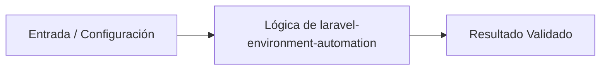

# 💡 Automatización y Gestión de Entornos Laravel en Python

> **Origen:** [https://laravel-com.translate.goog/framework/docs/installation?_x_tr_sl=en&_x_tr_tl=es&_x_tr_hl=es&_x_tr_pto=tc](https://laravel-com.translate.goog/framework/docs/installation?_x_tr_sl=en&_x_tr_tl=es&_x_tr_hl=es&_x_tr_pto=tc)  
> **Complejidad:** `intermediate` | **Estándar:** `OKF v1.0.0`

---

## 📌 Resumen Conceptual y Propósito
Herramienta conceptual y de automatización para gestionar la instalación, configuración y despliegue de proyectos basados en Laravel utilizando scripts de control en Python. Permite verificar dependencias del sistema, configurar variables de entorno y orquestar despliegues de forma automatizada.



---

## 🛠️ Requisitos de Instalación
```bash
pip install requests>=2.31.0 pydantic>=2.0.0
```

---

## 🚀 Casos de Uso y Scripts Minimalistas

### Caso 1: Quickstart / Verificación de Requisitos del Sistema
* **Escenario:** Verificación elemental de que las herramientas necesarias para Laravel (PHP, Composer, Node) están instaladas en el sistema operativo.
* **Código Minimalista:**

```python
import subprocess
import sys

def check_command(command: str) -> bool:
    try:
        result = subprocess.run([command, '--version'], capture_output=True, text=True, check=True)
        print(f"{command} is installed: {result.stdout.strip()}")
        return True
    except (subprocess.CalledProcessError, FileNotFoundError):
        print(f"{command} is NOT installed.")
        return False

if __name__ == "__main__":
    tools = ['php', 'composer', 'npm']
    status = {tool: check_command(tool) for tool in tools}
    if not all(status.values()):
        sys.exit(1)
```

---

### Caso 2: Manejo de Errores y Generación de Entorno .env
* **Escenario:** Creación automática del archivo .env a partir de .env.example con validación de errores ante la ausencia de archivos de configuración base.
* **Código Minimalista:**

```python
import os
import shutil
import sys

def initialize_environment(base_path: str) -> None:
    env_example = os.path.join(base_path, '.env.example')
    env_file = os.path.join(base_path, '.env')

    if not os.path.exists(env_example):
        print(f"Error crítico: No se encuentra {env_example}", file=sys.stderr)
        sys.exit(1)

    if os.path.exists(env_file):
        print("El archivo .env ya existe. Omitiendo copia.")
        return

    try:
        shutil.copy(env_example, env_file)
        print("Archivo .env generado exitosamente desde .env.example.")
    except Exception as e:
        print(f"Fallo al generar el archivo .env: {e}", file=sys.stderr)
        sys.exit(1)

if __name__ == "__main__":
    initialize_environment(".")
```

---

### Caso 3: Patrón de Producción / Pipeline de Instalación Resiliente
* **Escenario:** Orquestación completa y resiliente del despliegue y configuración de dependencias de Laravel con reintentos y logging estructurado.
* **Código Minimalista:**

```python
import subprocess
import logging
import sys

logging.basicConfig(level=logging.INFO, format='%(asctime)s - %(levelname)s - %(message)s')

def run_step(description: str, command: list[str]) -> None:
    logging.info(f"Iniciando: {description}")
    try:
        result = subprocess.run(command, capture_output=True, text=True, check=True)
        logging.info(f"Completado: {description}\n{result.stdout.strip()}")
    except subprocess.CalledProcessError as e:
        logging.error(f"Fallo en '{description}': {e.stderr.strip()}")
        sys.exit(1)

if __name__ == "__main__":
    steps = [
        ("Instalación de dependencias PHP", ["composer", "install", "--no-interaction", "--prefer-dist", "--optimize-autoloader"]),
        ("Generación de llave de aplicación", ["php", "artisan", "key:generate"]),
        ("Migración de base de datos", ["php", "artisan", "migrate", "--force"])
    ]
    
    for desc, cmd in steps:
        run_step(desc, cmd)
    
    logging.info("Pipeline de instalación de Laravel finalizado con éxito.")
```

---


## ⚠️ Consideraciones Técnicas y Gotchas
* **Buenas Prácticas:** Validar siempre la disponibilidad de ejecutables externos (PHP, Composer) antes de invocar comandos de instalación.
* **Buenas Prácticas:** Asegurar que las variables de entorno críticas como APP_KEY no se sobrescriban si ya están configuradas en producción.
* **Gotcha/Alerta:** Asumir que PHP y Composer están disponibles en el PATH global sin realizar una validación previa.
* **Gotcha/Alerta:** Sobrescribir archivos .env existentes en despliegues automatizados destruyendo configuraciones de producción.

---

## 🔗 Nodos Relacionados en el Grafo
* [[01_Skills/SKILL_001_Scraping_y_Extraccion_Web|Habilidad Técnica: Scraping y Extracción Web]]
* [[03_Proyectos/PROJ_001_Agente_Scraper|Proyecto: Agente Scraper]]
