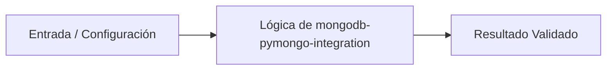

# 💡 Integración y Operación con MongoDB utilizando PyMongo

> **Origen:** [https://www.mongodb.com/es/docs/](https://www.mongodb.com/es/docs/)  
> **Complejidad:** `intermediate` | **Estándar:** `OKF v1.0.0`

---

## 📌 Resumen Conceptual y Propósito
MongoDB es una base de datos orientada a documentos diseñada para aplicaciones modernas. Permite almacenar documentos JSON enriquecidos que se mapean de forma natural a objetos de código, proporcionando capacidades avanzadas como consistencia ACID, transacciones, indexación geoespacial y búsquedas vectoriales a través de controladores oficiales como PyMongo.



---

## 🛠️ Requisitos de Instalación
```bash
pip install pymongo>=4.6.0
```

---

## 🚀 Casos de Uso y Scripts Minimalistas

### Caso 1: Quickstart / Implementación elemental básica
* **Escenario:** Conexión básica a una instancia de MongoDB, inserción de un documento JSON estructurado y realización de una consulta simple por campos anidados.
* **Código Minimalista:**

```python
from pymongo import MongoClient

# Conexión al servidor local de MongoDB
client = MongoClient("mongodb://localhost:27017/")
db = client["empresa_db"]
collection = db["people"]

# Inserción de documento basado en la documentación
doc = {
    "name": "Grace Hopper",
    "occupations": ["Computer Scientist", "Mathematician", "Professor"],
    "location": {"city": "Arlington", "state": "Virginia", "zip": "22202"}
}

inserted_id = collection.insert_one(doc).inserted_id
print(f"Documento insertado con ID: {inserted_id}")

# Consulta utilizando notación de puntos para campos anidados
result = collection.find_one({"location.city": "Arlington"})
print("Resultado de la consulta:", result)
```

---

### Caso 1: Quickstart / Implementación elemental básica
* **Escenario:** Inserción masiva segura manejando excepciones de conexión y errores de duplicidad de claves mediante operaciones tolerantes a fallos.
* **Código Minimalista:**

```python
from pymongo import MongoClient
from pymongo.errors import ConnectionFailure, BulkWriteError

try:
    client = MongoClient("mongodb://localhost:27017/", serverSelectionTimeoutMS=5000)
    client.admin.command('ping')
    db = client["empresa_db"]
    collection = db["people"]
    
    docs = [
        {"_id": 1, "name": "Alan Turing", "location": {"city": "London"}},
        {"_id": 2, "name": "Ada Lovelace", "location": {"city": "London"}},
        {"_id": 1, "name": "Duplicado", "location": {"city": "Paris"}} # Provoca error de clave duplicada
    ]
    
    try:
        result = collection.insert_many(docs, ordered=False)
        print(f"Insertados exitosamente: {len(result.inserted_ids)}")
    except BulkWriteError as bwe:
        print(f"Ocurrieron errores en la inserción por lotes: {bwe.details}")
        
except ConnectionFailure:
    print("No se pudo establecer conexión con el servidor MongoDB.")
finally:
    client.close()
```

---

### Caso 3: Patrón de Producción: Transacciones ACID y Resiliencia
* **Escenario:** Implementación de transacciones ACID multi-documento con reintentos automáticos para garantizar consistencia estricta en entornos distribuidos.
* **Código Minimalista:**

```python
from pymongo import MongoClient
from pymongo.errors import OperationFailure

client = MongoClient("mongodb://localhost:27017/")
db = client["empresa_db"]

def transfer_occupation(session, person_name, new_occupation):
    collection = db["people"]
    
    # Operación transaccional
    collection.update_one(
        {"name": person_name},
        {"$push": {"occupations": new_occupation}},
        session=session
    )

# Ejecución con patrón de reintento para transacciones ACID
with client.start_session() as session:
    try:
        with session.start_transaction():
            transfer_occupation(session, "Grace Hopper", "Systems Engineer")
            print("Transacción ACID completada exitosamente.")
    except OperationFailure as exc:
        print(f"Transacción abortada debido a un fallo: {exc}")
finally:
    client.close()
```

---


## ⚠️ Consideraciones Técnicas y Gotchas
* **Buenas Prácticas:** Utiliza operaciones por lotes (insert_many con ordered=False) para optimizar la ingesta masiva de datos.
* **Buenas Prácticas:** Implementa siempre bloques de gestión de sesiones y transacciones ACID cuando la consistencia de múltiples documentos sea crítica.
* **Buenas Prácticas:** Configura tiempos de espera explícitos (serverSelectionTimeoutMS) para evitar bloqueos prolongados ante caídas de red.
* **Gotcha/Alerta:** Olvidar cerrar el cliente de MongoDB o no utilizarlo como contexto, provocando fugas de conexiones.
* **Gotcha/Alerta:** Intentar realizar transacciones ACID en arquitecturas de nodos independientes (Standalone) que no soportan conjuntos de réplicas (Replica Sets).
* **Gotcha/Alerta:** No indexar campos consultados frecuentemente con notación de puntos (ej. location.city), degradando el rendimiento de lectura.

---

## 🔗 Nodos Relacionados en el Grafo
* [[01_Skills/SKILL_001_Scraping_y_Extraccion_Web|Habilidad Técnica: Scraping y Extracción Web]]
* [[03_Proyectos/PROJ_001_Agente_Scraper|Proyecto: Agente Scraper]]
